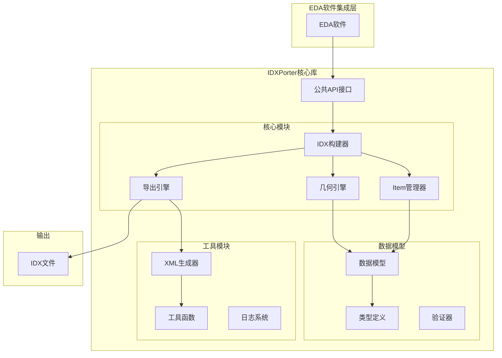

# IDXPorter 设计文档

## 概述

IDXPorter是一个基于TypeScript开发的IDX V4.5导出器工具库，采用模块化架构设计，为EDA软件提供完整的IDX文件生成能力。系统通过清晰的接口抽象和类型定义，支持PCB设计数据到IDX格式的转换，包括几何形状、层叠结构、组件信息等核心要素。

**几何计算引擎**：系统使用 [@flatten-js/core](https://github.com/alexbol99/flatten-js) (MIT协议) 作为底层2D几何计算库，提供高性能的几何运算能力，包括点、线、圆、弧等基础几何元素的创建、距离计算、相交检测、边界框计算等功能。通过适配器模式封装，既保留了IDX特定的业务逻辑（ID管理、验证、序列化），又获得了成熟几何库的强大计算能力。

## 架构设计

### 整体架构



### 模块职责

#### 1. 公共API接口层
- **IDXBuilder**: 主要构建器类，提供流式API
- **GeometryFactory**: 几何元素工厂类
- **ItemFactory**: Item元素工厂类
- **IDXExporter**: 导出器接口

#### 2. 核心模块
- **几何引擎**: 处理2D/2.5D几何形状的创建和管理，基于 @flatten-js/core
- **Item管理器**: 管理IDX中的各种Item类型
- **IDX构建器**: 协调整个IDX文档的构建过程
- **导出引擎**: 负责XML生成和文件输出

#### 3. 数据模型
- **类型定义**: 完整的TypeScript类型系统
- **数据模型**: IDX元素的内部表示，采用适配器模式封装几何库
- **验证器**: 数据完整性和正确性验证

### 几何库选型

#### 技术选型：@flatten-js/core

经过评估，系统选择 [@flatten-js/core](https://github.com/alexbol99/flatten-js) 作为底层2D几何计算库：

**选型理由**：
- **MIT协议**：商业友好，无使用限制
- **轻量级**：1.2MB，专注于2D几何计算
- **功能完整**：支持点、线、圆、弧、多边形等基础几何元素
- **高性能**：提供距离计算、相交检测、边界框计算等高效算法
- **TypeScript支持**：原生TypeScript类型定义
- **成熟稳定**：1.1k+ GitHub stars，经过大量项目验证
- **零依赖**：仅依赖 @flatten-js/interval-tree

**架构模式**：适配器模式

```
用户代码
    ↓
src/models/geometry/  (适配器层 - IDX特定封装)
    ├─ ID管理
    ├─ 业务验证
    ├─ JSON序列化
    └─ IDX特定方法
    ↓
@flatten-js/core     (底层库 - 几何计算)
    ├─ Point, Circle, Arc, Polygon
    ├─ 距离计算
    ├─ 相交检测
    └─ 边界框计算
```

**设计优势**：
1. **职责分离**：IDX业务逻辑与几何计算分离
2. **类型安全**：保持IDX特定的类型定义
3. **易于扩展**：可以利用 flatten-js 的高级功能（布尔运算、相交检测等）
4. **易于维护**：几何计算由成熟库处理，减少维护成本
5. **性能优秀**：利用优化的几何算法，提升计算效率

## 组件和接口设计

### 核心接口定义

```typescript
/**
 * IDX构建器主接口
 * 提供流式API用于构建IDX文档
 */
interface IIDXBuilder {
  /**
   * 创建文档头部
   */
  createHeader(options: HeaderOptions): IIDXBuilder;
  
  /**
   * 添加层定义
   */
  addLayer(layer: LayerDefinition): IIDXBuilder;
  
  /**
   * 添加板框轮廓
   */
  addBoardOutline(outline: BoardOutlineDefinition): IIDXBuilder;
  
  /**
   * 添加组件
   */
  addComponent(component: ComponentDefinition): IIDXBuilder;
  
  /**
   * 添加过孔
   */
  addVia(via: ViaDefinition): IIDXBuilder;
  
  /**
   * 添加禁止区域
   */
  addKeepoutArea(keepout: KeepoutAreaDefinition): IIDXBuilder;
  
  /**
   * 导出IDX文件
   */
  export(): Promise<string>;
}

/**
 * 几何工厂接口
 * 用于创建各种几何元素
 */
interface IGeometryFactory {
  /**
   * 创建点
   */
  createPoint(x: number, y: number): CartesianPoint;
  
  /**
   * 创建多段线
   */
  createPolyLine(points: CartesianPoint[], thickness?: number): PolyLine;
  
  /**
   * 创建圆形（中心点+直径）
   */
  createCircleCenter(center: CartesianPoint, diameter: number): CircleCenter;
  
  /**
   * 创建圆弧
   */
  createArc(start: CartesianPoint, end: CartesianPoint, radius: number, ccw: boolean): Arc;
  
  /**
   * 创建2.5D几何体
   */
  createCurveSet2d(geometry: GeometryElement, lowerBound: number, upperBound: number): CurveSet2d;
}

/**
 * Item工厂接口
 * 用于创建各种IDX Item
 */
interface IItemFactory {
  /**
   * 创建基础Item
   */
  createItem(id: string, name: string, itemType: ItemType, geometryType?: GeometryType): Item;
  
  /**
   * 创建Item实例
   */
  createItemInstance(instanceName: InstanceName, transformation?: Transformation): ItemInstance;
  
  /**
   * 创建用户属性
   */
  createUserProperty(key: PropertyKey, value: string): UserProperty;
  
  /**
   * 创建标识符
   */
  createIdentifier(scope: string, number: string, version: string, revision: string, sequence: number): Identifier;
}
```

### 数据模型设计

#### 1. 基础类型定义

```typescript
/**
 * IDX几何类型枚举
 */
enum GeometryType {
  // 板级类型
  BOARD_OUTLINE = 'BOARD_OUTLINE',
  BOARD_AREA_RIGID = 'BOARD_AREA_RIGID',
  BOARD_AREA_FLEXIBLE = 'BOARD_AREA_FLEXIBLE',
  BOARD_AREA_STIFFENER = 'BOARD_AREA_STIFFENER',
  
  // 组件类型
  COMPONENT = 'COMPONENT',
  COMPONENT_MECHANICAL = 'COMPONENT_MECHANICAL',
  
  // 孔类型
  VIA = 'VIA',
  FILLED_VIA = 'FILLED_VIA',
  HOLE_PLATED = 'HOLE_PLATED',
  HOLE_NON_PLATED = 'HOLE_NON_PLATED',
  HOLE_PLATED_MILLED = 'HOLE_PLATED_MILLED',
  HOLE_NONPLATED_MILLED = 'HOLE_NONPLATED_MILLED',
  
  // 禁止区类型
  KEEPOUT_AREA_COMPONENT = 'KEEPOUT_AREA_COMPONENT',
  KEEPOUT_AREA_ROUTE = 'KEEPOUT_AREA_ROUTE',
  KEEPOUT_AREA_VIA = 'KEEPOUT_AREA_VIA',
  KEEPOUT_AREA_TESTPOINT = 'KEEPOUT_AREA_TESTPOINT',
  KEEPOUT_AREA_THERMAL = 'KEEPOUT_AREA_THERMAL',
  KEEPOUT_AREA_OTHER = 'KEEPOUT_AREA_OTHER',
  
  // 保留区类型
  KEEPIN_AREA_COMPONENT = 'KEEPIN_AREA_COMPONENT',
  KEEPIN_AREA_ROUTE = 'KEEPIN_AREA_ROUTE',
  KEEPIN_AREA_VIA = 'KEEPIN_AREA_VIA',
  KEEPIN_AREA_TESTPOINT = 'KEEPIN_AREA_TESTPOINT',
  KEEPIN_AREA_OTHER = 'KEEPIN_AREA_OTHER',
  
  // 层类型
  LAYER_SILKSCREEN = 'LAYER_SILKSCREEN',
  LAYER_SOLDERMASK = 'LAYER_SOLDERMASK',
  LAYER_SOLDERPASTE = 'LAYER_SOLDERPASTE',
  LAYER_OTHERSIGNAL = 'LAYER_OTHERSIGNAL',
  LAYER_POWERORGROUND = 'LAYER_POWERORGROUND',
  LAYER_DIELECTRIC = 'LAYER_DIELECTRIC',
  LAYER_STACKUP = 'LAYER_STACKUP'
}

/**
 * Item类型枚举
 */
enum ItemType {
  SINGLE = 'single',
  ASSEMBLY = 'assembly'
}

/**
 * 单位类型枚举
 */
enum UnitLength {
  UNIT_MM = 'UNIT_MM',
  UNIT_INCH = 'UNIT_INCH'
}
```

#### 2. 几何数据模型

**设计说明**：几何模型采用适配器模式，封装 @flatten-js/core 库提供的2D几何计算能力，同时保留IDX特定的业务逻辑（ID管理、验证、序列化）。

```typescript
/**
 * 笛卡尔坐标点
 * 
 * @description
 * 封装 Flatten.Point，提供IDX特定的ID管理和序列化功能
 */
interface CartesianPoint {
  readonly id: string;
  readonly x: number;
  readonly y: number;
  readonly flattenPoint: Flatten.Point;  // 底层几何对象，用于高性能计算
}

/**
 * 多段线
 * 
 * @description
 * 封装 Flatten.Polygon 或 Flatten.Segment[]，支持开放和闭合多段线
 */
interface PolyLine {
  readonly id: string;
  readonly points: CartesianPoint[];
  readonly thickness?: number | undefined;
  readonly closed: boolean;
  readonly flattenShape: Flatten.Polygon | Flatten.Segment[];  // 底层几何对象
}

/**
 * 圆形（中心点定义）
 * 
 * @description
 * 封装 Flatten.Circle，提供中心点+直径的定义方式
 */
interface CircleCenter {
  readonly id: string;
  readonly centerPoint: CartesianPoint;
  readonly diameter: number;
  readonly flattenCircle: Flatten.Circle;  // 底层几何对象
}

/**
 * 圆弧
 * 
 * @description
 * 封装 Flatten.Arc，支持起点、终点、半径和方向定义
 */
interface Arc {
  readonly id: string;
  readonly startPoint: CartesianPoint;
  readonly endPoint: CartesianPoint;
  readonly radius: number;
  readonly isCCW: boolean;
  readonly flattenArc: Flatten.Arc;  // 底层几何对象
}

/**
 * 2.5D几何体
 */
interface CurveSet2d {
  readonly id: string;
  readonly shapeDescriptionType: 'GeometricModel';
  readonly lowerBound: number;
  readonly upperBound: number;
  readonly detailedGeometricModelElement: GeometryElement;
}

/**
 * 几何元素联合类型
 */
type GeometryElement = PolyLine | CircleCenter | Arc | CompositeCurve | BSplineCurve | Ellipse;
```

#### 3. IDX结构数据模型

```typescript
/**
 * IDX文档头部
 */
interface Header {
  readonly creatorName?: string;
  readonly description?: string;
  readonly creatorCompany?: string;
  readonly creatorSystem?: string;
  readonly creator?: string;
  readonly globalUnitLength: UnitLength;
  readonly creationDateTime?: string;
  readonly userProperties?: UserProperty[];
}

/**
 * IDX文档主体
 */
interface Body {
  readonly items: Item[];
  readonly shapeElements: ShapeElement[];
  readonly geometryElements: GeometryElement[];
}

/**
 * 处理指令
 */
interface ProcessInstruction {
  readonly type: 'SendInformation' | 'SendChanges' | 'Clearance';
}

/**
 * 完整的IDX文档
 */
interface IDXDocument {
  readonly header: Header;
  readonly body: Body;
  readonly processInstruction: ProcessInstruction;
}
```

#### 4. Item数据模型

```typescript
/**
 * IDX Item基础接口
 */
interface Item {
  readonly id: string;
  readonly name: string;
  readonly description?: string;
  readonly itemType: ItemType;
  readonly geometryType?: GeometryType;
  readonly identifier: Identifier;
  readonly referenceName?: string;
  readonly baseline?: boolean;
  readonly userProperties?: UserProperty[];
  readonly itemInstance?: ItemInstance;
  readonly assembleToName?: string;
  readonly shape?: string; // ShapeElement ID引用
}

/**
 * Item实例
 */
interface ItemInstance {
  readonly instanceName: InstanceName;
  readonly transformation?: Transformation;
  readonly item?: string; // Item ID引用
  readonly userProperties?: UserProperty[];
}

/**
 * 标识符
 */
interface Identifier {
  readonly systemScope: string;
  readonly number: string;
  readonly version: string;
  readonly revision: string;
  readonly sequence: number;
}

/**
 * 实例名称
 */
interface InstanceName {
  readonly systemScope: string;
  readonly objectName: string;
}

/**
 * 2D变换矩阵
 */
interface Transformation {
  readonly transformationType: 'd2';
  readonly xx: number;
  readonly xy: number;
  readonly yx: number;
  readonly yy: number;
  readonly tx: number;
  readonly ty: number;
}

/**
 * 用户属性
 */
interface UserProperty {
  readonly key: PropertyKey;
  readonly value: string;
}

/**
 * 属性键
 */
interface PropertyKey {
  readonly systemScope: string;
  readonly objectName: string;
}
```

## XML生成策略

### 使用 xmlbuilder2 库

经过评估，我们选择使用 `xmlbuilder2` 作为XML生成库，原因如下：

#### 技术选型分析

| 方案 | 优势 | 劣势 | 许可证 |
|------|------|------|--------|
| **xmlbuilder2** | • 优秀的注释支持<br>• 现代化流式API<br>• TypeScript友好<br>• 支持命名空间<br>• 良好的性能 | • 增加一个依赖 | ✅ MIT |
| **fast-xml-parser** | • 功能完整<br>• 双向支持 | • 注释支持有限<br>• API不够直观 | ✅ MIT |
| **自定义生成器** | • 零依赖<br>• 完全控制 | • 需要维护<br>• 功能相对简单 | N/A |

#### XML注释支持

`xmlbuilder2` 提供了优秀的注释功能：

```typescript
import { create } from 'xmlbuilder2';

// # 创建带注释的IDX文档
const doc = create({ version: '1.0', encoding: 'UTF-8' })
  .com('IDX V4.5 文档 - 由IDXPorter生成')
  .ele('foundation:EDMDDataSet', {
    'xmlns:foundation': 'http://www.prostep.org/ecad-mcad/edmd/4.0/foundation',
    'xmlns:pdm': 'http://www.prostep.org/ecad-mcad/edmd/4.0/pdm'
  })
    .com('文档头部信息')
    .ele('foundation:Header')
      .com('创建者信息')
      .ele('foundation:CreatorCompany').txt('MyCompany').up()
      .com('创建时间')
      .ele('foundation:CreationDateTime').txt(new Date().toISOString()).up()
    .up()
    .com('主体数据部分 - 包含所有设计元素')
    .ele('foundation:Body')
      .com('板框轮廓定义')
      .ele('foundation:Item', { id: 'BOARD_1', geometryType: 'BOARD_OUTLINE' })
        .com('板厚度属性')
        .ele('foundation:UserProperty')
          // 更多结构...
        .up()
      .up()
    .up()
  .up();

const xml = doc.end({ 
  prettyPrint: true,
  indent: '  ',
  newline: '\n'
});
```

#### 注释功能特性

1. **灵活位置**：可在任意XML元素前后添加注释
2. **多种格式**：
   ```typescript
   .com('单行注释')
   .com(['多行注释', '第二行', '第三行'])
   ```
3. **结构化注释**：支持在不同层级添加说明性注释
4. **格式化**：自动处理缩进和换行，保持良好的可读性

#### XML生成器封装

我们将封装 `xmlbuilder2` 提供统一的接口：

```typescript
/**
 * IDX XML生成器
 * 
 * @description
 * 基于xmlbuilder2的IDX专用XML生成器，提供便捷的API和注释支持
 */
export class IDXXMLGenerator {
  private doc: XMLBuilder;
  
  constructor() {
    this.doc = create({ version: '1.0', encoding: 'UTF-8' });
  }
  
  /**
   * 添加注释
   */
  addComment(comment: string | string[]): IDXXMLGenerator {
    this.doc.com(comment);
    return this;
  }
  
  /**
   * 添加元素
   */
  addElement(name: string, attributes?: Record<string, any>): IDXXMLGenerator {
    this.doc.ele(name, attributes);
    return this;
  }
  
  /**
   * 生成XML字符串
   */
  toString(): string {
    return this.doc.end({ 
      prettyPrint: true,
      indent: '  ',
      newline: '\n'
    });
  }
}
```

## 错误处理策略

```typescript
/**
 * IDXPorter错误基类
 */
abstract class IDXPorterError extends Error {
  abstract readonly code: string;
  abstract readonly category: ErrorCategory;
}

/**
 * 错误类别
 */
enum ErrorCategory {
  VALIDATION = 'VALIDATION',
  GEOMETRY = 'GEOMETRY',
  EXPORT = 'EXPORT',
  CONFIGURATION = 'CONFIGURATION'
}

/**
 * 验证错误
 */
class ValidationError extends IDXPorterError {
  readonly code = 'VALIDATION_ERROR';
  readonly category = ErrorCategory.VALIDATION;
  
  constructor(message: string, public readonly field?: string) {
    super(message);
  }
}

/**
 * 几何错误
 */
class GeometryError extends IDXPorterError {
  readonly code = 'GEOMETRY_ERROR';
  readonly category = ErrorCategory.GEOMETRY;
  
  constructor(message: string, public readonly geometryId?: string) {
    super(message);
  }
}
```

### 验证策略

```typescript
/**
 * 数据验证器接口
 */
interface IValidator<T> {
  validate(data: T): ValidationResult;
}

/**
 * 验证结果
 */
interface ValidationResult {
  readonly isValid: boolean;
  readonly errors: ValidationError[];
  readonly warnings: ValidationWarning[];
}

/**
 * 几何验证器
 */
class GeometryValidator implements IValidator<GeometryElement> {
  validate(geometry: GeometryElement): ValidationResult {
    // [验证] 检查几何元素的有效性
    // 1. 点坐标范围检查
    // 2. 多段线闭合性检查
    // 3. 圆弧参数合理性检查
    // 4. 复合几何的连续性检查
  }
}

/**
 * Item验证器
 */
class ItemValidator implements IValidator<Item> {
  validate(item: Item): ValidationResult {
    // [验证] 检查Item的完整性
    // 1. 必要字段存在性检查
    // 2. ID唯一性检查
    // 3. 引用完整性检查
    // 4. geometryType与实际几何的匹配性检查
  }
}
```

## 测试策略

### 测试架构

```typescript
/**
 * 测试工具类
 */
class IDXTestUtils {
  /**
   * 创建测试用的几何元素
   */
  static createTestGeometry(): GeometryElement {
    // [测试] 创建标准测试几何
  }
  
  /**
   * 验证生成的XML格式
   */
  static validateXMLOutput(xml: string): boolean {
    // [测试] 使用XSD验证XML格式
  }
  
  /**
   * 比较两个IDX文档的等价性
   */
  static compareIDXDocuments(doc1: IDXDocument, doc2: IDXDocument): boolean {
    // [测试] 深度比较文档结构
  }
}

/**
 * 几何测试套件
 */
describe('GeometryFactory', () => {
  test('should create valid CartesianPoint', () => {
    // [测试] 点创建功能
  });
  
  test('should create closed PolyLine', () => {
    // [测试] 多段线创建和闭合
  });
  
  test('should create CircleCenter with valid diameter', () => {
    // [测试] 圆形创建和参数验证
  });
});

/**
 * Item测试套件
 */
describe('ItemFactory', () => {
  test('should create Item with correct geometryType', () => {
    // [测试] Item创建和类型设置
  });
  
  test('should validate Item references', () => {
    // [测试] Item引用完整性
  });
});

/**
 * 集成测试套件
 */
describe('IDXBuilder Integration', () => {
  test('should generate complete IDX file', () => {
    // [测试] 完整IDX文件生成
  });
  
  test('should handle complex PCB design', () => {
    // [测试] 复杂PCB设计的处理
  });
});
```

### 测试覆盖目标

1. **单元测试覆盖率**: ≥85%
2. **集成测试**: 覆盖主要使用场景
3. **性能测试**: 大型设计文件处理能力
4. **兼容性测试**: 与主流MCAD软件的兼容性

## 性能考虑

### 内存管理

```typescript
/**
 * 对象池管理器
 * 用于复用频繁创建的对象，减少GC压力
 */
class ObjectPool<T> {
  private pool: T[] = [];
  
  constructor(private factory: () => T, private reset: (obj: T) => void) {}
  
  acquire(): T {
    return this.pool.pop() || this.factory();
  }
  
  release(obj: T): void {
    this.reset(obj);
    this.pool.push(obj);
  }
}

/**
 * 几何对象池
 */
const pointPool = new ObjectPool(
  () => ({ id: '', x: 0, y: 0 } as CartesianPoint),
  (point) => { /* reset point */ }
);
```

### 流式处理

```typescript
/**
 * 流式XML生成器
 * 避免在内存中构建完整的XML DOM
 */
class StreamingXMLGenerator {
  private stream: WritableStream;
  
  constructor(output: WritableStream) {
    this.stream = output;
  }
  
  /**
   * 流式写入XML元素
   */
  async writeElement(element: XMLElement): Promise<void> {
    // [性能] 直接写入流，不缓存完整XML
  }
}
```

## 扩展性设计

### 插件架构

```typescript
/**
 * 几何类型插件接口
 */
interface IGeometryTypePlugin {
  readonly geometryType: GeometryType;
  
  /**
   * 创建对应类型的Item
   */
  createItem(definition: any): Item;
  
  /**
   * 验证Item定义
   */
  validateDefinition(definition: any): ValidationResult;
  
  /**
   * 生成XML片段
   */
  generateXML(item: Item): string;
}

/**
 * 插件管理器
 */
class PluginManager {
  private plugins = new Map<GeometryType, IGeometryTypePlugin>();
  
  /**
   * 注册几何类型插件
   */
  registerPlugin(plugin: IGeometryTypePlugin): void {
    this.plugins.set(plugin.geometryType, plugin);
  }
  
  /**
   * 获取几何类型插件
   */
  getPlugin(geometryType: GeometryType): IGeometryTypePlugin | undefined {
    return this.plugins.get(geometryType);
  }
}
```

### 配置系统

```typescript
/**
 * IDXPorter配置接口
 */
interface IDXPorterConfig {
  /**
   * 默认单位
   */
  readonly defaultUnit: UnitLength;
  
  /**
   * 精度设置
   */
  readonly precision: number;
  
  /**
   * XML格式化选项
   */
  readonly xmlFormatting: {
    readonly indent: boolean;
    readonly indentSize: number;
  };
  
  /**
   * 验证选项
   */
  readonly validation: {
    readonly strict: boolean;
    readonly warnOnMissingReferences: boolean;
  };
  
  /**
   * 性能选项
   */
  readonly performance: {
    readonly useObjectPool: boolean;
    readonly streamingOutput: boolean;
  };
}

/**
 * 默认配置
 */
const DEFAULT_CONFIG: IDXPorterConfig = {
  defaultUnit: UnitLength.UNIT_MM,
  precision: 0.001,
  xmlFormatting: {
    indent: true,
    indentSize: 2
  },
  validation: {
    strict: true,
    warnOnMissingReferences: true
  },
  performance: {
    useObjectPool: true,
    streamingOutput: false
  }
};
```

## 总结

IDXPorter的设计采用了模块化、可扩展的架构，通过清晰的接口定义和完整的类型系统，为EDA软件提供了强大而灵活的IDX文件生成能力。设计重点关注了：

1. **类型安全**: 完整的TypeScript类型定义
2. **模块化**: 清晰的职责分离和接口抽象
3. **扩展性**: 插件架构支持新的几何类型
4. **性能**: 内存管理和流式处理优化
5. **可靠性**: 全面的验证和错误处理
6. **可测试性**: 完善的测试策略和工具

该设计为后续的实现提供了坚实的基础，确保系统能够满足各种复杂的PCB设计需求。