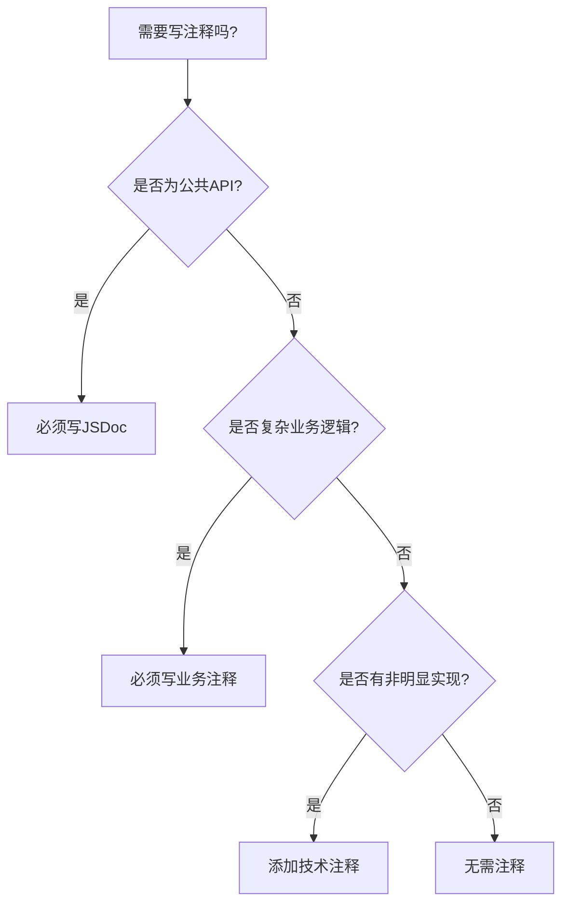
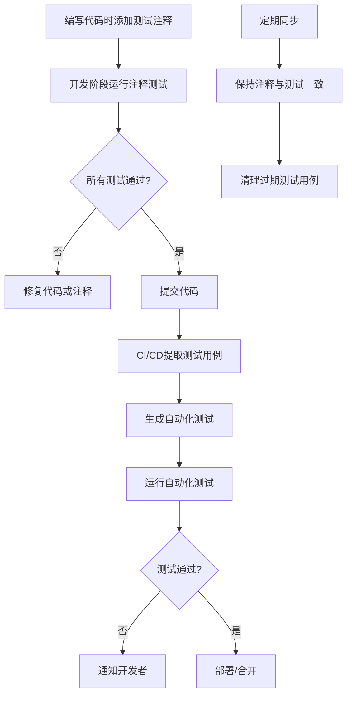

# TypeScript代码注释规范指南 v1.2

## 📜 前言

代码注释作为沟通的桥梁，平衡着开发效率与长期维护成本。我们采用统一、一致的标记体系，制定适合TypeScript项目的现代化注释规范。

### 注释哲学流派对比

| 流派 | 核心理念 | 适用场景 | 采用程度 |
|------|----------|----------|----------|
| **JSDoc/TSDoc** | 注释即文档 | 公共API、库、SDK | ✅ 强制 |
| **自文档代码** | 代码即文档 | 简单工具函数、私有方法 | ✅ 优先 |
| **注释即契约** | 定义行为边界 | 关键算法、安全模块 | ⚠️ 选择性 |
| **注释即测试** | 示例即说明 | 复杂API、DSL设计 | ✅ 推荐 |
| **注释即设计** | 记录决策过程 | 业务核心、复杂模块 | ✅ 推荐 |
| **注释即沟通** | 团队协作媒介 | 所有协作场景 | ✅ 必须 |

**指导原则**：统一标记格式，保持一致性；公共接口文档化，私有逻辑自解释，复杂业务说清楚。

---

## 🎯 核心理念

代码为骨，注释为脉。脉络贵精而不贵多，杂乱的脉络暴露混乱的骨架。

1. **统一格式**：所有注释遵循一致的"标签: 内容"格式
2. **代码优先**：清晰的结构和命名胜过冗余注释
3. **注释为补**：只解释代码无法表达的内容
4. **层次分明**：通过视觉层次快速导航复杂逻辑
5. **实用导向**：降低维护成本，提高可读性

---

## 📝 统一注释标记体系

### 一、结构标记（必须掌握）

```typescript
// # 主要逻辑阶段
// ## 子步骤或子功能
// ### 详细步骤（慎用，通常意味着需要重构）
```

### 二、内容分类标记（按需使用）

```typescript
// BUSINESS: 业务逻辑说明
// DESIGN: 设计决策理由
// PERFORMANCE: 性能相关说明
// SECURITY: 安全注意事项
// COMPATIBILITY: 兼容性说明
// TEST: 测试相关提示
// ALGORITHM: 算法原理说明
// CONFIG: 配置项说明
// DATA: 数据结构说明
```

### 三、说明性标记

```typescript
// NOTE: 需要特别注意的说明
// WARN: 警告信息（比NOTE更严重）
// QUESTION: 疑问/待确认的问题
// REF: 相关代码/文档引用
// REASON: 解释"为什么这样做"
// TIP: 使用技巧或最佳实践
```

### 四、开发状态标记（必须掌握）

```typescript
// TODO(负责人): YYYY-MM-DD 描述 [P0-URGENT|P1-IMPORTANT|P2-NICE_TO_HAVE]
// FIXME(负责人): YYYY-MM-DD 描述 [P0-URGENT|P1-IMPORTANT]
// HACK: 临时解决方案说明
// DEPRECATED: 替代方案说明
// OPTIMIZE: 优化建议
// REFACTOR: 重构建议
// EXPERIMENTAL: 实验性功能，API可能变更
// BUG: 已知缺陷描述
```

**优先级说明**：
- `P0-URGENT`: 必须立即处理，如安全漏洞、严重性能问题
- `P1-IMPORTANT`: 重要功能缺陷，应在当前迭代修复
- `P2-NICE_TO_HAVE`: 优化建议，可在后续迭代安排

### 五、测试关联标记（注释即测试）

```typescript
// TEST_CASE: 测试用例ID或描述
// TEST_SCENARIO: 测试场景描述
// TEST_EXPECT: 预期行为说明
// TEST_REQUIRE: 测试前置条件
// TEST_INPUT: 测试输入参数
// TEST_ASSERT: 断言条件说明
// TEST_PERFORMANCE: 性能要求说明
// TEST_SECURITY: 安全要求说明
```

### 六、视觉引导标记（增强可读性）

```typescript
// ============= 主要区块标题 =============
// 区块说明文字...

// ------------ 子区块标题 ------------
// 子区块说明...

// --- 步骤/注意事项 ---
// 具体说明...
```

---

## 📊 注释密度指导

### 决策流程



### 量化标准

| 代码类型 | 建议注释覆盖率 | 注释要点 |
|---------|---------------|----------|
| **公共API** | 100% | 完整JSDoc + 示例 + 测试用例 |
| **业务服务** | 60-80% | 业务规则 + 设计决策 + 测试场景 |
| **工具函数** | 30-50% | 算法原理 + 边界条件 + 测试用例 |
| **数据模型** | 100%字段 | 业务含义 + 约束条件 + 测试数据 |

### 注释行数控制

- 简单函数：≤ 20%代码行数
- 复杂函数：≤ 40%代码行数  
- 极复杂算法：≤ 60%代码行数（考虑拆分）

---

## 📚 最佳实践示例

### 示例1：用户登录服务（统一标记版）

```typescript
/**
 * 用户登录认证服务
 * 
 * @example
 * ```typescript
 * // TEST_CASE: Normal login flow
 * // TEST_REQUIRE: User registered, correct password
 * // TEST_EXPECT: Returns success status and valid token
 * const result = await loginService.authenticate('user@example.com', 'password123');
 * assert(result.success === true);
 * assert(typeof result.token === 'string');
 * ```
 * 
 * @see UserRepository.findByIdentifier
 * @see AuthService.generateToken
 */
class LoginService {
  /**
   * 执行用户认证
   * 
   * @param username - 用户名（邮箱或手机号）
   * @param password - 密码（明文，前端已加密）
   * @returns 认证结果及令牌
   * 
   * @throws {ValidationError} 输入参数无效
   * @throws {AuthError} 认证失败
   * @throws {AccountLockedError} 账户被锁定
   * 
   * @testScenario Normal login flow
   * @testScenario Wrong password flow
   * @testScenario Account locked flow
   */
  async authenticate(username: string, password: string): Promise<AuthResult> {
    // ============= 输入验证阶段 =============
    // WARN: 所有输入必须经过验证，防止注入攻击
    // SECURITY: SQL注入和XSS防护
    // TEST_CASE: 输入验证失败
    // TEST_EXPECT: 抛出ValidationError异常
    if (!this.isValidCredential(username, password)) {
      throw new ValidationError('无效的凭据格式');
    }
    
    // ============= 用户查询阶段 =============
    // BUSINESS: 支持邮箱和手机号两种登录方式
    // DESIGN: 将用户标识符统一处理，简化后续逻辑
    const user = await this.findUserByIdentifier(username);
    
    // --- 用户存在性检查 ---
    // TEST_CASE: 用户不存在
    if (!user) {
      // SECURITY: 用户不存在时也记录日志，用于安全分析
      await this.recordFailedAttempt(null, username);
      throw new AuthError('用户名或密码错误');
    }
    
    // ============= 安全验证阶段 =============
    // ## 账户状态检查
    // BUSINESS: 连续失败5次锁定账户（需求: SEC-2024-001）
    // TEST_CASE: 账户锁定验证
    if (user.failedAttempts >= LOCK_THRESHOLD) {
      throw new AccountLockedError('账户已锁定，请联系客服解锁');
    }
    
    // ## 密码验证
    // SECURITY: 使用恒定时间比较，防止时序攻击
    // SECURITY: 即使密码错误也执行完整的验证流程
    const isValid = await this.verifyPassword(password, user.passwordHash);
    
    if (!isValid) {
      // BUSINESS: 记录失败尝试，用于安全分析
      await this.recordFailedAttempt(user.id);
      throw new AuthError('用户名或密码错误');
    }
    
    // ============= 令牌生成阶段 =============
    // DESIGN: 选择JWT：无状态、易于扩展、支持移动端
    // PERFORMANCE: JWT签名消耗可接受，缓存可优化
    const token = this.generateJWT(user);
    
    // ============= 后续处理阶段 =============
    // NOTE: 异步执行，不阻塞响应
    // TEST_CASE: 登录成功后续处理
    this.updateLastLogin(user.id).catch(logError);
    
    // TODO(张三): 2024-03-20 添加登录设备记录功能 [P1-IMPORTANT]
    // FIXME(李四): 2024-03-15 JWT密钥应移至环境变量 [P0-URGENT]
    
    return { 
      success: true, 
      token, 
      user: this.sanitizeUser(user),
      // DESIGN: 返回token过期时间，方便前端自动刷新
      expiresIn: TOKEN_EXPIRY_SECONDS
    };
  }
}
```

### 示例2：订单处理函数（统一标记版）

```typescript
// ============= 订单处理主流程 =============
// BUSINESS: 将订单处理视为状态机：验证 → 检查 → 支付 → 完成
// TEST_SCENARIO: Normal order processing flow
// TEST_SCENARIO: Out-of-stock order flow
// TEST_SCENARIO: Payment failure flow
async function processOrder(orderId: string): Promise<ProcessResult> {
  // ------------ 订单验证阶段 ------------
  const order = await orderRepository.findById(orderId);
  
  // BUSINESS: 已取消订单不应再处理
  // TEST_CASE: Processing cancelled order
  // TEST_EXPECT: Throws InvalidOrderError
  if (order.status === OrderStatus.CANCELLED) {
    throw new InvalidOrderError('订单已取消，无法处理');
  }
  
  // ------------ 库存检查阶段 ------------
  // BUSINESS: 预售商品跳过库存检查
  // TEST_CASE: Pre-sale order processing
  // TEST_EXPECT: Skips inventory check, proceeds to payment
  if (!order.isPreSale) {
    const hasStock = await inventoryService.checkStock(order.items);
    if (!hasStock) {
      // BUSINESS: 记录缺货商品，用于补货分析
      await this.recordOutOfStockItems(order.items);
      throw new OutOfStockError('部分商品缺货，已通知补货');
    }
  }
  
  // ============= 支付处理阶段 =============
  // DESIGN: 保证支付事务原子性，避免部分成功
  // SECURITY: 支付请求必须加密传输
  const paymentResult = await paymentService.processPayment(order);
  
  // QUESTION: 支付失败重试策略待优化
  // 当前：记录日志，人工处理
  // 建议：实现指数退避自动重试
  // BUG: 支付失败时未通知用户 [P1-IMPORTANT]
  if (!paymentResult.success) {
    logger.error('支付失败', { 
      orderId, 
      error: paymentResult.error,
      // DESIGN: 记录支付网关响应，便于排查
      gatewayResponse: paymentResult.gatewayResponse
    });
    throw new PaymentFailedError('支付失败，请稍后重试');
  }
  
  // ============= 订单完成阶段 =============
  // ## 状态更新
  // TEST_CASE: Order status update
  // TEST_EXPECT: Order status changes to completed
  await orderRepository.updateStatus(orderId, 'completed');
  
  // ## 库存扣减
  // PERFORMANCE: 必须在事务内完成，避免超卖
  // TEST_CASE: Inventory deduction verification
  await inventoryService.deductStock(order.items);
  
  // ## 发送通知
  // NOTE: 非关键路径，失败不影响主流程
  // TEST_CASE: Notification sending verification
  notificationService.sendConfirmation(order).catch(logError);
  
  return { 
    success: true, 
    orderId,
    // DESIGN: 返回处理时间戳，用于后续跟踪
    processedAt: new Date().toISOString()
  };
}
```

---

## 🧪 注释即测试工作流

### 完整工作流程



### 1. 开发阶段：注释驱动测试

```typescript
// 开发时添加测试注释
function calculateDiscount(price: number, userType: UserType): number {
  // TEST_CASE: VIP用户折扣计算
  // TEST_INPUT: price=100, userType='VIP'
  // TEST_EXPECT: 返回90 (10%折扣)
  // TEST_CASE: 普通用户折扣计算
  // TEST_INPUT: price=100, userType='NORMAL'
  // TEST_EXPECT: 返回95 (5%折扣)
  // TEST_CASE: 价格低于门槛无折扣
  // TEST_INPUT: price=49, userType='VIP'
  // TEST_EXPECT: 返回49 (无折扣)
  
  if (price < 50) return price;
  
  const discountRate = userType === 'VIP' ? 0.1 : 0.05;
  return price * (1 - discountRate);
}
```

### 2. 工具配置：测试注释提取

```javascript
// jest.config.js - 配置测试注释处理器
module.exports = {
  // ... 其他配置
  setupFilesAfterEnv: [
    './test/setupCommentTests.js'
  ],
  // 自定义处理器，从注释提取测试用例
  testMatch: [
    '**/__tests__/**/*.[jt]s?(x)',
    '**/?(*.)+(spec|test).[jt]s?(x)',
    '**/?(*.)+(comment-test).[jt]s?(x)' // 注释测试文件
  ]
};
```

```javascript
// scripts/extract-comment-tests.js
/**
 * 从源代码提取注释中的测试用例
 * 生成对应的Jest测试文件
 */
async function extractCommentTests() {
  // 1. 扫描所有.ts文件
  // 2. 提取TEST_CASE、TEST_INPUT、TEST_EXPECT等标记
  // 3. 生成对应的.test.ts文件
  // 4. 更新测试用例索引
}
```

### 3. CI/CD集成：自动化验证

```yaml
# .github/workflows/comment-tests.yml
name: Comment Tests Validation

on:
  push:
    branches: [main, develop]
  pull_request:
    branches: [main]

jobs:
  validate-comments:
    runs-on: ubuntu-latest
    
    steps:
    - uses: actions/checkout@v3
    
    - name: Extract comment tests
      run: |
        npm run extract-comment-tests
        # 生成测试报告
        
    - name: Run generated tests
      run: |
        npm run test:comment-generated
        
    - name: Check comment coverage
      run: |
        npm run check-comment-coverage
        # 检查关键函数是否有测试注释
        
    - name: Validate TODO/FIXME dates
      run: |
        npm run validate-todo-dates
        # 检查TODO/FIXME是否过期
```

### 4. 测试注释规范

```typescript
// 完整测试注释模板
/**
 * 函数功能描述
 * 
 * @testScenario 场景1描述
 * @testScenario 场景2描述
 * 
 * @testCase 测试用例1
 * @testInput param1=value1, param2=value2
 * @testExpect 预期输出或行为
 * @testRequire 前置条件
 * @testEdge 边界条件说明
 * @testPerformance 性能要求
 */
function exampleFunction(param1: string, param2: number): Result {
  // TEST_CASE: 测试用例ID或简短描述
  // TEST_INPUT: 输入参数说明
  // TEST_EXPECT: 预期输出
  // TEST_ASSERT: 断言条件
  // TEST_REQUIRE: 前置条件
  // TEST_PERFORMANCE: 性能要求（如<100ms）
  // TEST_SECURITY: 安全要求
  // TEST_COMPATIBILITY: 兼容性要求
  
  return result;
}
```

---

## 🚫 注释反模式

### 1. **废话注释**
```typescript
// ❌ 坏 - 重复代码
const users = getUsers();  // 获取用户列表

// ✅ 好 - 说明原因
const users = getUsers();  // PERFORMANCE: 缓存用户数据，减少DB查询
```

### 2. **过时注释**
```typescript
// ❌ 坏 - 注释与代码不符
// 这里使用同步读取
const data = await fs.readFileAsync('file.txt');

// ✅ 好 - 保持同步
const data = await fs.readFileAsync('file.txt');
// DESIGN: 使用异步读取避免阻塞事件循环
```

### 3. **过度装饰**
```typescript
// ❌ 坏 - 过多emoji干扰阅读
// 🚀✨🎉 开始处理用户数据 💫🔥⭐

// ✅ 好 - 简洁专业
// ============= 用户数据处理 =============
```

### 4. **不一致的标记格式**
```typescript
// ❌ 坏 - 混合使用不同格式
// ! 重要提示
// [安全] 注意安全
// TODO: 待办事项

// ✅ 好 - 统一格式
// WARN: 重要提示
// SECURITY: 注意安全
// TODO(张三): 2024-03-15 待办事项
```

---

## 🛠️ 工具支持

### ESLint配置（增强版）
```javascript
// .eslintrc.js
module.exports = {
  plugins: [
    'jsdoc', 
    'todo-check',
    'comment-test', // 自定义插件：检查测试注释
    'comment-format' // 自定义插件：检查注释格式
  ],
  
  rules: {
    // JSDoc要求
    'jsdoc/require-jsdoc': ['error', {
      require: {
        FunctionDeclaration: true,
        MethodDefinition: true,
        ClassDeclaration: true,
        ArrowFunctionExpression: false
      }
    }],
    
    // 注释格式检查
    'comment-format/validate': ['warn', {
      allowedPatterns: [
        '^\\s*//\\s*(#+|\\w+:)', // 允许#标题和标签:格式
        '^\\s*//\\s*[=|-]',      // 允许视觉引导标记
        '^\\s*//\\s*$',          // 允许空注释行
      ],
      message: '请使用标准注释格式：标签: 内容 或 # 标题'
    }],
    
    // 标签格式检查
    'comment-format/valid-tags': ['error', {
      allowedTags: [
        // 内容分类标签
        'BUSINESS', 'DESIGN', 'PERFORMANCE', 'SECURITY', 'COMPATIBILITY', 
        'TEST', 'ALGORITHM', 'CONFIG', 'DATA',
        // 说明性标签
        'NOTE', 'WARN', 'QUESTION', 'REF', 'REASON', 'TIP',
        // 开发状态标签
        'TODO', 'FIXME', 'HACK', 'DEPRECATED', 'OPTIMIZE', 
        'REFACTOR', 'EXPERIMENTAL', 'BUG',
        // 测试标签
        'TEST_CASE', 'TEST_SCENARIO', 'TEST_EXPECT', 'TEST_REQUIRE',
        'TEST_INPUT', 'TEST_ASSERT', 'TEST_PERFORMANCE', 'TEST_SECURITY'
      ],
      requireColon: true
    }],
    
    // TODO管理
    'todo-check/todo-check': ['error', {
      terms: ['TODO', 'FIXME', 'BUG', 'HACK'],
      location: 'start',
      dateFormat: 'YYYY-MM-DD'
    }],
    
    // 测试注释覆盖率
    'comment-test/coverage': ['warn', {
      minPublicApiCoverage: 0.8,
      minComplexFunctionCoverage: 0.6
    }]
  }
};
```

### VSCode代码片段（增强版）
```json
{
  "Visual Block Comment": {
    "prefix": "c=",
    "body": "// ============= ${1:区块标题} =============\n// ${2:说明文字}$0",
    "description": "视觉区块注释"
  },
  "Visual Subblock Comment": {
    "prefix": "c-",
    "body": "// ------------ ${1:子区块标题} ------------\n// ${2:说明文字}$0",
    "description": "视觉子区块注释"
  },
  "Business Comment": {
    "prefix": "cb",
    "body": "// BUSINESS: ${1:业务逻辑说明}$0",
    "description": "业务注释"
  },
  "Design Comment": {
    "prefix": "cd",
    "body": "// DESIGN: ${1:设计决策理由}$0",
    "description": "设计注释"
  },
  "Security Comment": {
    "prefix": "cs",
    "body": "// SECURITY: ${1:安全注意事项}$0",
    "description": "安全注释"
  },
  "Note Comment": {
    "prefix": "cn",
    "body": "// NOTE: ${1:需要特别注意的说明}$0",
    "description": "注意注释"
  },
  "Warning Comment": {
    "prefix": "cw",
    "body": "// WARN: ${1:警告信息}$0",
    "description": "警告注释"
  },
  "Test Case Comment": {
    "prefix": "ctc",
    "body": "// TEST_CASE: ${1:测试用例描述}\n// TEST_INPUT: ${2:输入参数}\n// TEST_EXPECT: ${3:预期结果}$0",
    "description": "测试用例注释"
  },
  "Todo with Priority": {
    "prefix": "todo",
    "body": "// TODO(${1|张三,李四,王五|}): ${CURRENT_YEAR}-${CURRENT_MONTH}-${CURRENT_DATE} ${2:描述} [${3|P0-URGENT,P1-IMPORTANT,P2-NICE_TO_HAVE|}]",
    "description": "带优先级的待办事项"
  }
}
```

### 专用工具脚本
```typescript
// scripts/comment-analytics.ts
/**
 * 注释分析工具
 * 提供注释覆盖率、质量评分等功能
 */

interface CommentMetrics {
  totalLines: number;
  commentLines: number;
  jsdocCoverage: number;
  todoCount: number;
  fixmeCount: number;
  testCommentCount: number;
  commentQualityScore: number; // 0-100
}

// 分析项目注释质量
async function analyzeComments(): Promise<CommentMetrics> {
  // 实现注释分析逻辑
  // 1. 扫描所有TypeScript文件
  // 2. 统计注释行数和总行数
  // 3. 检查JSDoc覆盖率
  // 4. 统计各类标签使用情况
  // 5. 评估注释质量（格式规范性、内容价值等）
  // 6. 生成报告
}
```

---

## 📋 代码审查清单（增强版）

### 提交前检查
```bash
# 1. 语法和类型检查
npm run type-check

# 2. 代码规范检查  
npm run lint

# 3. TODO/FIXME扫描和过期检查
npm run check-todos

# 4. 测试注释提取和验证
npm run extract-test-comments

# 5. 注释覆盖率报告
npm run comment-coverage

# 6. 注释格式验证
npm run validate-comment-format
```

### 审查要点
1. ✅ 公共API是否有完整JSDoc和测试示例？
2. ✅ 复杂业务逻辑是否说明清楚并有测试场景？
3. ✅ 是否使用了统一的标准注释格式？
4. ✅ TODO/FIXME是否有明确描述、日期和优先级？
5. ✅ 注释是否与代码保持同步？
6. ✅ 是否有"注释即测试"的测试用例？
7. ✅ 设计决策是否有充分的REASON说明？
8. ✅ 视觉引导是否增强了可读性而非干扰？
9. ✅ 标签是否使用英文大写格式？
10. ✅ 安全相关代码是否有SECURITY注释？

---

## 🔄 维护与演进

### 注释更新流程
```
修改代码 → 检查相关注释 → 更新/删除注释 → 运行检查 → 提交
```

### 定期清理计划
- **每周**：清理过期的TODO标记
- **每两周**：同步测试注释与自动化测试
- **每月**：review关键模块的注释准确性  
- **每季度**：评估注释规范适用性，必要时调整

### 团队协作机制
1. **新成员培训**：2小时掌握核心标记体系
2. **代码审查**：注释质量纳入review标准，特别关注格式一致性
3. **知识分享**：定期分享优秀注释案例，讨论最佳实践
4. **注释研讨会**：每月讨论注释规范演进和改进

---

## 📅 版本记录

| 版本 | 日期 | 变更说明 |
|------|------|----------|
| v1.0 | 2026-01-05 | 初始版本，制定基础规范 |
| v1.1 | 2026-01-14 | 新增"注释即测试"工作流，增强视觉引导 |
| v1.2 | 2026-01-15 | 统一标记格式为"标签: 内容"，使用英文大写标签 |

### v1.2 详细变更内容

#### 标记体系统一
1. **全面采用"标签: 内容"格式**
   - 所有标签使用英文大写
   - 移除了方括号标签格式
   - 移除了特殊符号标记（!、?、*）

2. **标准标签体系**
   - 内容分类标签：BUSINESS、DESIGN、PERFORMANCE、SECURITY等
   - 说明性标签：NOTE、WARN、QUESTION、REF、REASON等
   - 开发状态标签：TODO、FIXME、HACK、DEPRECATED等
   - 测试关联标签：TEST_CASE、TEST_SCENARIO、TEST_EXPECT等

3. **简化视觉引导**
   - 保留 =、- 视觉分隔符
   - 移除方向性引用标记（↗↘⇄），使用REF标签替代

#### 工具链更新
1. 更新ESLint规则，强制检查标签格式
2. 更新VSCode代码片段，支持新标签格式
3. 完善标签验证机制

#### 最佳实践更新
1. 所有示例代码更新为统一格式
2. 强调格式一致性的重要性
3. 提供标签使用指南

---

## ❓ 常见问题

**Q：何时应该写注释？**  
A：当代码无法清晰表达意图时，特别是：业务规则、设计决策、复杂算法、安全考虑、测试场景。

**Q：注释应该多详细？**  
A：足够让其他开发者（包括6个月后的你）快速理解，无需过度。使用视觉引导提高可读性。

**Q：如何保持注释更新？**  
A：修改代码时同步修改注释，定期review，工具自动化检查，CI/CD强制验证。

**Q：为什么要用英文标签？**  
A：英文标签更国际化，便于工具解析，避免编码问题，且与TypeScript/JSDoc生态一致。

**Q：测试注释真的能替代测试代码吗？**  
A：不是替代，而是补充。测试注释帮助理解测试意图，可以自动生成测试骨架，但仍需编写具体测试逻辑。

**Q：标签太多记不住？**  
A：先掌握核心标签（TODO、NOTE、WARN、BUSINESS、DESIGN、SECURITY），其他按需使用。IDE代码片段可以帮助快速输入。

---

## 🚀 下一步计划

### v1.3 规划功能
1. **AI辅助注释生成** - 集成AI工具自动生成和优化注释
2. **注释质量度量指标** - 建立可量化的注释质量评估体系
3. **IDE深度集成** - 开发团队专属的VSCode扩展，提供智能提示
4. **多语言支持** - 支持国际化团队的注释翻译和同步

### 立即行动项
1. 在团队中推广统一标记体系
2. 配置CI/CD注释检查流水线
3. 开展注释规范培训
4. 收集使用反馈，持续优化
5. 建立标签使用统计和优化机制

> **最终建议**：注释是工具，不是目的。最好的文档是清晰的代码本身，最好的注释是恰到好处的补充。在可读性、维护成本和开发效率间找到平衡。

*本文档将持续演进，欢迎通过团队渠道反馈建议*